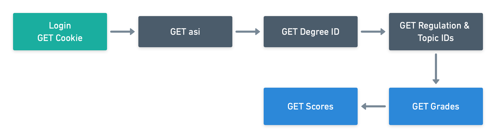

# node-ossc

This is an API Server to easly get grades and exam data from the OSSC grades server. The API uses Firebase as a backend in order to store none user related information about the exams, scraped from the website.

## 🛣 Concept

Here you can see a flow diagram on how to retrive the students grades and the scores of each exam from the OSSC site. Each box represents a single HTTP Request. Each request depends on information from the previous request.

## 👩‍💻 Usage

In order to use the API you can either deploy the code on a PaaS (e.g. [Heroku](https://heroku.com)) or try it out locally.

## 🌍 Resources

- **[Using ESLint and Prettier in a TypeScript Project](https://www.robertcooper.me/using-eslint-and-prettier-in-a-typescript-project)**:

  Here are some core takeaways from this article.
  He has used the `.js` config files in order to add comments.

  **ESLint**: 
  A linter checks the code for any errors or missformated code.

  - `eslint`: The core ESLint linting library

  **TypeScript**:

  - `@typescript-eslint/parser`: The parser that will allow ESLint to lint TypeScript code.
  - `@typescript-eslint/eslint-plugin`: A plugin that contains a nunch of ESLint rules that are TypeScript specific.

  **Prettier**: 
  Prettier does not check the code for errors but forces a particular code style.

  - `prettier`: The core prettier library.
  - `eslint-config-prettier`: Disables ESLint rules that would otherwise interfear with prettier.
  - `eslint-plugin-prettier`: Runs prettier as an ESLint rule.

  **Husky**: 
  To prevent files from being commited that don't follow the ESLint conventions Husky can be used to lint before commiting any changes.
  [GitHub](https://github.com/typicode/husky)

- **[Get Started with Typescript in 2019](https://www.robertcooper.me/get-started-with-typescript-in-2019)**:

  - `tsconfig.json`: Used to configure the typescript compiler

- **[CLI apps in TypeScript via ts-node](https://www.geekytidbits.com/cli-apps-in-typescript-via-ts-node/)**

  - `ts-node`: The ts-node executable allows you to run your typescript code directly from within your terminal, without the need to use the typescript compiler `tsc`.

- **[TypeScript-Node-Starter](https://github.com/microsoft/TypeScript-Node-Starter)**
  - I have used this boilerplate to setup all the scripts necessary to run the server.

## 👨‍⚖️ Disclaimer

I will not take any responsibility for any malfunctions or consequences that may arise from using this tool.
